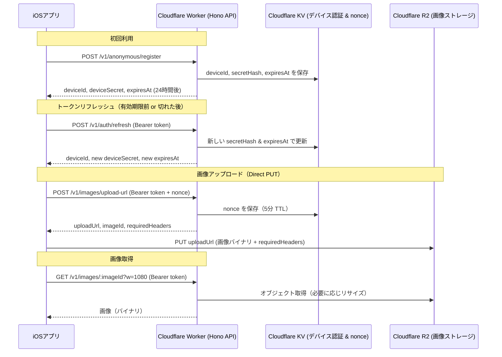

## oyakata-app
Cloudflare Workers + R2 による画像保存/取得。アップロードは R2 への Direct PUT（S3 署名URL）。

## 使用技術
- Cloudflare Workers（Hono）
- Cloudflare R2（画像ストレージ）
- Cloudflare KV（デバイス認証情報・任意の nonce 再利用防止）

## API（要約）
- POST `/v1/anonymous/register`
  - res: `{ deviceId, deviceSecret, expiresAt }`
- POST `/v1/auth/refresh`（認証必須、期限切れトークンも可）
  - res: `{ deviceId, deviceSecret, expiresAt }`
- POST `/v1/images/upload-url`（認証必須）
  - req: `contentType`, `sizeBytes?`, `nonce` (必須)
  - res: `{ imageId, uploadUrl, expiresAt, requiredHeaders }`
- GET `/v1/images/:imageId`（認証必須、`w?` 等の簡易リサイズ）
  - 画像バイナリ（`Content-Type`/`Cache-Control`）
- DELETE `/v1/images/:imageId`（認証必須）
  - res: `{ ok: true }`（idempotent）

## 認証
- Bearer トークン認証。例: `Authorization: Bearer {deviceId}.{deviceSecret}`
- トークン有効期限: 24時間（登録時・リフレッシュ時に `expiresAt` で通知）
- 期限切れトークンは `/v1/auth/refresh` でのみ使用可能（新しいトークンを発行）
- **リプレイ攻撃防止**: state-changing 操作（例: `/v1/images/upload-url`）では、リクエストボディに `nonce` (UUID) を含める必須
  - `nonce` は KV で 5分間保持され、再利用時はエラー (`nonce_reused`)
  - クライアント側で crypto.randomUUID() などで一意な値を生成

## オブジェクト/キー設計
- `imageId`: ULID/UUIDv7。
- R2 キー: `deviceId/images/{imageId}`（KV のマッピング不要）。
- `customMetadata`: `deviceId`, `imageId`, `contentType`, `hash?` など任意。

## アップロード（Direct PUT）
- 方式: R2 の S3 互換プリサインド URL（SigV4, Query 署名, 期限 ~300s）。
- Worker は `/v1/images/upload-url` で URL を発行し、クライアントは R2 に直接 `PUT`。
- 返却 `requiredHeaders`（例: `Content-Type`）は PUT 時に必須。値不一致は R2 が拒否。
- サイズ上限はクライアント側で事前チェック（SigV4 PUT 単体では強制不可）。必要なら将来 POST ポリシーへ切替。

## 取得/リサイズ
- Worker が R2 から取得し返却。`w`（幅）等のパラメータで Cloudflare Image Resizing を適用可能。
- キャッシュ: `Cache-Control`/`ETag` を設定し、パラメータをキャッシュキーに含める。

## 削除
- 所有権（`deviceId`）を確認し削除。存在しなくても成功（idempotent）。

## エラーモデル（共通形式）
- 失敗時: `{ ok: false, error: 'code', message? }`
- 主な `error`:
  - `unauthorized`: 認証失敗（deviceId 不明 or token 不一致）
  - `token_expired`: トークン有効期限切れ（`/v1/auth/refresh` で更新可能）
  - `nonce_required`: nonce が必須だが提供されていない
  - `nonce_reused`: nonce が再利用された（リプレイ攻撃の可能性）
  - `kv_read_failed` / `kv_write_failed`: KV 操作失敗
  - `r2_rejected`: R2 操作失敗
  - `not_found`: リソースが見つからない

## 設定メモ
- `wrangler.jsonc` に `r2_buckets`/`kv_namespaces` を定義し、`npm run cf-typegen`。
- R2 用の `ACCESS_KEY_ID`/`SECRET_ACCESS_KEY` は `wrangler secret` で投入（最小権限）。

## シーケンス

